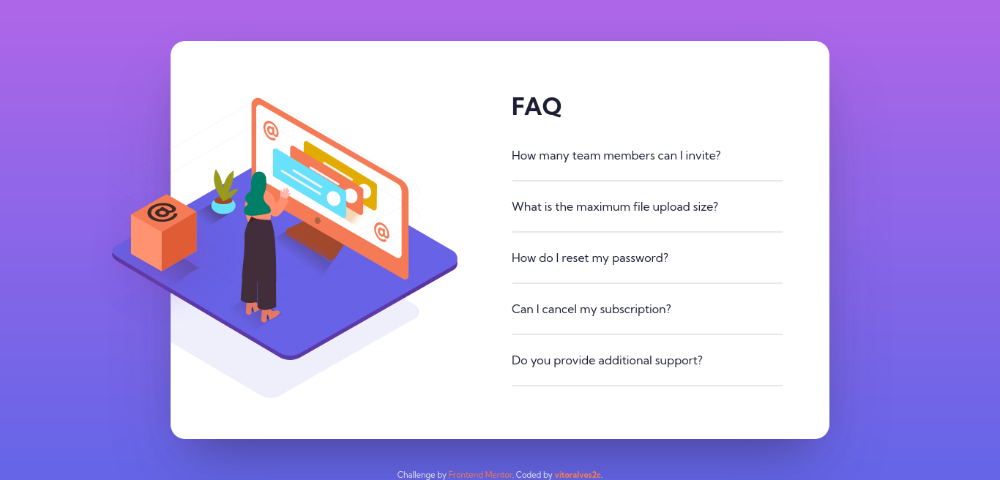

# Frontend Mentor - NFT preview card component solution

This is a solution to the [FAQ accordion card challenge on Frontend Mentor](https://www.frontendmentor.io/challenges/faq-accordion-card-XlyjD0Oam). Frontend Mentor challenges help you improve your coding skills by building realistic projects. 

## Table of contents

- [Overview](#overview)
  - [The challenge](#the-challenge)
  - [Screenshot](#screenshot)
  - [Links](#links)
- [My process](#my-process)
  - [Built with](#built-with)
  - [Useful resources](#useful-resources)
- [Author](#author)

## Overview

### The challenge

Users should be able to:

- View the optimal layout depending on their device's screen size
- See hover states for interactive elements

### Screenshot

### Links

- Solution URL: [https://www.frontendmentor.io/solutions/faq-accordion-card-oon2HvFjT](https://www.frontendmentor.io/solutions/faq-accordion-card-oon2HvFjT)
- Live Site URL: [https://vitoralves2c.github.io/FAQ-Accordion-Card/](https://vitoralves2c.github.io/FAQ-Accordion-Card/)

## My process

### Built with

- HTML5 markup
- CSS custom properties
- Flexbox
- Mobile-first workflow

### Useful resources

- [MDN Docs](https://developer.mozilla.org/en-US/) - Mozilla Developer Network helped with some CSS properties that I needed while I was styling the project.
- [W3Schools](https://www.w3schools.com/) - W3Schools was very useful during the styling process of the project because on top of a good documentation it also has live examples to show you how things work, which is veru helpful.

## Author

- Github - [vitoraves2c](https://github.com/vitoralves2c)
- Frontend Mentor - [@vitoralves2c](https://www.frontendmentor.io/profile/vitoralves2c)
